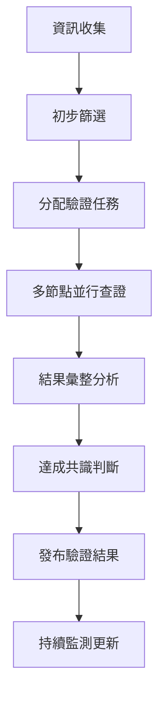

# 區塊鏈拜占庭驗證法防滲透指南

## 2026年中共非正規作戰應用情境

### 概述

從區塊鏈技術的拜占庭驗證法，來看如何防止滲透。本指南將區塊鏈的去中心化驗證概念應用於資訊戰防護，讓民眾能夠在複雜的資訊環境中，透過多方驗證機制識別真偽，抵禦滲透與假資訊攻擊。

**核心理念**：不依賴單一權威，透過多點驗證建立可信的資訊網絡  
**適用情境**：2026年中共非正規作戰中的資訊滲透防護  
**目標群體**：一般民眾、社區組織、媒體工作者

---

## 一、拜占庭將軍問題與現代資訊戰

### 1.1 經典問題重述

**拜占庭將軍問題（Byzantine Generals Problem）**是區塊鏈領域的一個經典問題，它描述了在存在叛徒的情況下，如何讓多個將軍在沒有中央權威的情況下達成一致的決策。

#### 原始情境

```text
拜占庭帝國的多支軍隊包圍敵方城市
各軍隊只能透過信使傳遞消息
部分將軍可能是叛徒，會發送虛假消息
如何在存在叛徒的情況下達成一致行動？
```

#### 現代資訊戰對應

```text
台灣社會面臨中共資訊滲透
各種媒體管道傳遞不同訊息
部分資訊來源可能被滲透或操控
如何在混亂資訊中找出真相並達成共識？
```

### 1.2 問題核心挑戰

#### 信任危機

| 傳統軍事 | 現代資訊戰 |
|---------|-----------|
| 叛徒將軍發送假命令 | 滲透媒體發布假新聞 |
| 通訊管道被截斷 | 網路攻擊與資訊封鎖 |
| 無法確認消息真偽 | 深偽技術與移花接木 |
| 需要達成攻擊共識 | 需要維持社會團結 |

#### 解決方案需求

- **去中心化**：不依賴單一權威機構
- **多方驗證**：透過多個獨立來源確認
- **容錯機制**：即使部分節點失效仍能運作
- **共識達成**：在不確定環境中形成可信結論

---

## 二、拜占庭容錯機制原理

### 2.1 BFT核心概念

**拜占庭容錯（Byzantine Fault Tolerance, BFT）**是一種共識機制，它允許網絡中的節點在存在故障或惡意節點的情況下，仍然能夠達成一致的決策。

#### 數學基礎

```text
假設總節點數為 n，惡意節點數為 f
BFT 要求：n ≥ 3f + 1
即：惡意節點數不能超過總數的 1/3
```

#### 實際應用轉換

```markdown
資訊來源總數：n = 10個
可能的假資訊來源：f = 3個
可信度閾值：n - f = 7個來源一致
結論：需要至少7個獨立來源確認才可信
```

### 2.2 驗證流程設計

#### 三階段驗證協議

**階段一：提案階段（Propose）**

```markdown
1. 收集多方資訊來源
2. 記錄各來源的具體內容
3. 標註資訊來源的可信度等級
4. 建立初步資訊圖譜
```

**階段二：投票階段（Vote）**

```markdown
1. 各獨立驗證節點進行事實查核
2. 對資訊真實性進行評分
3. 提供具體的佐證資料
4. 記錄驗證過程與結果
```

**階段三：確認階段（Commit）**

```markdown
1. 統計各節點的驗證結果
2. 計算整體可信度分數
3. 形成最終判斷結論
4. 發布驗證報告
```

---

## 三、實戰應用：民眾版拜占庭驗證

### 3.1 簡化驗證法則

從民眾的角度來看滲透，用最簡單的方法來舉例，透過多人提供的訊息來回推，這樣的訊息是否可信，進而決策。

#### 「3-5-7法則」

**3個來源**：任何重要資訊至少需要3個獨立來源確認
**5個角度**：從5個不同角度檢視資訊的合理性
**7成把握**：達到70%確信度才採取行動

#### 實用驗證步驟

```markdown
步驟1：來源多樣性檢查
□ 是否來自不同類型媒體？
□ 是否有官方與民間來源？
□ 是否包含國內外觀點？

步驟2：時間一致性檢查
□ 各來源報導時間是否合理？
□ 是否存在可疑的同步性？
□ 消息傳播路徑是否自然？

步驟3：內容邏輯檢查
□ 事實描述是否前後一致？
□ 因果關係是否合理？
□ 數據引用是否可驗證？

步驟4：動機合理性檢查
□ 誰會從此訊息中獲益？
□ 是否符合常理與經驗？
□ 有無明顯的情緒操作？

步驟5：佐證資料檢查
□ 是否有具體的證據支持？
□ 相關當事人是否回應？
□ 專家意見是否一致？
```

### 3.2 資訊節點分類

#### 可信度等級劃分

**A級節點（高可信度）**

```markdown
- 政府官方機構
- 知名媒體機構
- 學術研究機構
- 國際組織報告
- 當事人直接證詞
```

**B級節點（中等可信度）**

```markdown
- 一般媒體報導
- 業界專家意見
- 社群媒體消息
- 民間組織聲明
- 目擊者證詞
```

**C級節點（低可信度）**

```markdown
- 匿名消息來源
- 未經證實的爆料
- 極端偏頗的觀點
- 情緒化的言論
- 明顯的廣告訊息
```

**X級節點（不可信）**

```markdown
- 已知的假消息來源
- 被滲透的媒體管道
- 惡意帳號或機器人
- 明顯的造假內容
- 邏輯完全不通的訊息
```

---

## 四、2026年情境實戰案例

### 4.1 案例一：台海軍演消息驗證

#### 假設情境

**2026年8月某日，各管道出現以下消息：**

```markdown
來源A（某電視台）：解放軍在台海進行「史上最大規模軍演」
來源B（網路媒體）：軍演規模為「武統預演」，台灣已無退路
來源C（社群媒體）：內部消息指出，軍演將持續一個月
來源D（境外媒體）：美軍已秘密增兵關島，準備武力干預
來源E（官方消息）：國防部：密切關注解放軍例行性演習
```

#### 拜占庭驗證分析

**第一步：節點分類**

```markdown
A級節點：來源E（官方消息）
B級節點：來源A（主流媒體）
C級節點：來源B、C（網路/社群）
待驗證：來源D（境外媒體）
```

**第二步：內容交叉驗證**

```markdown
事實層面：
✓ 解放軍確實在進行軍演（A、E確認）
✗ 「史上最大規模」缺乏數據支持
✗ 「武統預演」為推測性判斷
✗ 「持續一個月」無官方證實
✗ 「美軍增兵」無可信來源

情緒層面：
- 來源A：中性報導
- 來源B：明顯煽動恐慌
- 來源C：散布不確定消息
- 來源D：製造國際緊張
- 來源E：冷靜客觀表述
```

**第三步：拜占庭計算**

```markdown
總節點數：n = 5
可疑節點：f = 2-3（B、C確定可疑，D待查）
可信閾值：n - f = 2-3

結論：
- 基本事實（軍演存在）：可信度高
- 規模誇大：可信度低
- 政治解讀：可信度極低
- 國際反應：需進一步驗證
```

### 4.2 案例二：經濟數據操作識別

#### 假設情境

**2026年10月，關於台灣經濟的不同報導：**

```markdown
來源1：主計總處公布Q3 GDP成長率為2.1%
來源2：某財經媒體：「台灣經濟衰退，GDP恐負成長」  
來源3：證券分析師：「中美貿易戰衝擊，台股將崩盤」
來源4：網路論壇：「政府隱瞞真實數據，實際已經衰退」
來源5：國際信評機構：維持台灣信評穩定展望
來源6：中國媒體：「台灣經濟泡沫即將破滅」
```

#### 驗證矩陣分析

| 來源 | 可信度 | 具體數據 | 佐證資料 | 動機檢查 | 綜合評分 |
|------|--------|----------|----------|----------|----------|
| 來源1 | A級 | 具體(2.1%) | 官方統計 | 中性 | 90分 |
| 來源2 | B級 | 模糊 | 選擇性引用 | 點閱率 | 40分 |
| 來源3 | B級 | 預測性 | 個人判斷 | 專業意見 | 60分 |
| 來源4 | C級 | 無 | 陰謀論 | 煽動不滿 | 20分 |
| 來源5 | A級 | 評級維持 | 專業報告 | 中性 | 85分 |
| 來源6 | X級 | 情緒化 | 政治宣傳 | 統戰目的 | 10分 |

#### 共識形成過程

**可信節點共識**（A級+部分B級）：

- 官方數據顯示經濟穩定成長
- 國際評級機構維持正面評價
- 短期波動屬正常範圍

**可疑訊息識別**：

- 刻意誇大負面影響
- 缺乏具體數據支撐
- 明顯的政治操作意圖

**最終判斷**：
台灣經濟基本面穩定，部分唱衰消息為刻意操作。

---

## 五、建立個人拜占庭驗證系統

### 5.1 資訊來源建構

#### 多元化資訊組合

**官方管道（30%）**

```markdown
- 政府機關官網
- 官方新聞稿
- 立法院公報
- 司法判決書
- 統計資料庫
```

**主流媒體（40%）**

```markdown
- 傳統報紙（聯合、自由、中時）
- 電視新聞（台視、中視、華視）
- 網路媒體（ETtoday、NOWnews）
- 國際媒體中文版（BBC、CNN）
```

**專業意見（20%）**

```markdown
- 學術期刊文章
- 專家學者專欄
- 智庫研究報告
- 業界分析報告
- 專業論壇討論
```

**民間聲音（10%）**

```markdown
- 公民記者報導
- NGO組織聲明
- 社群媒體討論
- 民意調查結果
- 當事人證詞
```

### 5.2 個人驗證工具包

#### 快速檢核清單

**30秒快篩**

```markdown
□ 標題是否過於聳動？
□ 是否提供具體數據？
□ 消息來源是否明確？
□ 時間地點是否合理？
□ 是否符合常識判斷？
```

**3分鐘驗證**

```markdown
□ 查看其他媒體是否報導
□ 檢查官方是否有回應
□ 搜尋相關背景資訊
□ 確認專家如何解讀
□ 觀察社群反應情況
```

**10分鐘深度檢查**

```markdown
□ 追溯消息最初來源
□ 查證具體事實數據
□ 分析報導邏輯脈絡
□ 比較不同觀點差異
□ 形成個人判斷結論
```

#### 驗證工具推薦

**事實查核網站**

```markdown
- 台灣事實查核中心
- MyGoPen 麥擱騙
- 蘭姆酒吐司
- Cofacts 真的假的
```

**數據查詢平台**

```markdown
- 政府資料開放平台
- 主計總處統計資料
- 中央選舉委員會
- 法務部廉政署
```

**國際比較來源**

```markdown
- Reuters 路透社
- AP News 美聯社
- 德國之聲中文
- 日本NHK中文
```

---

## 六、社群應用：建立驗證網絡

### 6.1 社區拜占庭節點

#### 角色分工設計

**核心驗證節點（3-5人）**

```markdown
職責：
- 負責重要訊息的深度查核
- 協調其他節點的驗證工作
- 維護驗證標準的一致性
- 發布最終驗證結果

條件：
- 具備媒體識讀能力
- 有充足的時間投入
- 客觀理性的判斷能力
- 良好的溝通協調技巧
```

**專業諮詢節點（10-15人）**

```markdown
職責：
- 提供特定領域的專業意見
- 協助技術性內容的查證
- 解讀複雜的數據資料
- 提供國際視野的分析

條件：
- 各領域的專業背景
- 願意分享專業知識
- 保持中立客觀立場
- 能夠簡化專業術語
```

**一般監測節點（50-100人）**

```markdown
職責：
- 日常的資訊收集與回報
- 初步的真偽判斷
- 協助訊息的傳播澄清
- 參與驗證結果的討論

條件：
- 關心社會公共議題
- 具備基本媒體素養
- 願意花時間參與
- 有一定的社群影響力
```

### 6.2 共識機制運作

#### 驗證流程設計



#### 投票權重設計

**權重分配原則**

```markdown
核心節點：權重 × 3
專業節點：權重 × 2  
一般節點：權重 × 1
新加入節點：權重 × 0.5（觀察期）
```

**共識閾值設定**

```markdown
一般議題：60%同意即可通過
重要議題：70%同意才能通過
爭議議題：80%同意才能定案
緊急議題：50%同意暫時通過，後續追蹤
```

---

## 七、技術增強：數位化拜占庭驗證

### 7.1 區塊鏈記錄系統

#### 不可篡改的驗證記錄

**資料結構設計**

```json
{
  "id": "verification_20260815_001",
  "timestamp": "2026-08-15T10:30:00Z",
  "original_claim": "解放軍史上最大軍演",
  "sources": [
    {
      "source_id": "media_a",
      "content": "軍演內容描述",
      "credibility": "B",
      "verification_score": 6
    }
  ],
  "validators": [
    {
      "validator_id": "node_001",
      "score": 7,
      "evidence": "查證證據連結",
      "signature": "數位簽章"
    }
  ],
  "consensus_result": {
    "final_score": 6.2,
    "confidence": "medium",
    "status": "verified"
  }
}
```

#### 智能合約自動化

**自動驗證觸發**

```solidity
contract InformationVerification {
    mapping(string => Verification) public verifications;
    
    function submitVerification(
        string memory claimId,
        uint8 score,
        string memory evidence
    ) public {
        require(isAuthorizedValidator(msg.sender), "Not authorized");
        
        verifications[claimId].addScore(score, evidence);
        
        if (verifications[claimId].isConsensusReached()) {
            emit ConsensusReached(claimId, verifications[claimId].finalScore);
        }
    }
}
```

### 7.2 AI輔助驗證

#### 自然語言處理分析

**情感分析引擎**

```python
def analyze_sentiment_bias(text):
    """
    分析文本的情感偏向與可能的操作意圖
    """
    sentiment_score = sentiment_analyzer.analyze(text)
    bias_indicators = detect_bias_keywords(text)
    manipulation_signals = detect_manipulation(text)
    
    return {
        'sentiment': sentiment_score,
        'bias_level': bias_indicators,
        'manipulation_risk': manipulation_signals,
        'credibility_score': calculate_credibility(
            sentiment_score, bias_indicators, manipulation_signals
        )
    }
```

**來源可信度評估**

```python
def evaluate_source_credibility(source_url, historical_data):
    """
    基於歷史數據評估資訊來源的可信度
    """
    domain_reputation = get_domain_reputation(source_url)
    historical_accuracy = calculate_historical_accuracy(source_url, historical_data)
    bias_pattern = analyze_bias_pattern(source_url, historical_data)
    
    credibility_score = weighted_average([
        (domain_reputation, 0.4),
        (historical_accuracy, 0.4),
        (bias_pattern, 0.2)
    ])
    
    return credibility_score
```

---

## 八、危機應對：緊急驗證機制

### 8.1 快速響應協議

#### 緊急情況分級

**第一級：一般假訊息**

```markdown
響應時間：2小時內
驗證節點：3個核心節點
共識閾值：簡單多數（>50%）
處理方式：標準驗證流程
```

**第二級：影響性假訊息**

```markdown
響應時間：1小時內
驗證節點：5個核心節點 + 相關專家
共識閾值：絕對多數（>60%）
處理方式：加速驗證 + 即時澄清
```

**第三級：危機性假訊息**

```markdown
響應時間：30分鐘內
驗證節點：全部核心節點 + 緊急專家組
共識閾值：高度共識（>75%）
處理方式：緊急動員 + 廣泛澄清
```

### 8.2 應急備案機制

#### 節點失效應對

**單點故障**

```markdown
檢測：節點無回應超過設定時間
應對：自動切換至備用節點
記錄：記錄故障原因與時間
恢復：故障節點修復後重新驗證
```

**多點故障**

```markdown
檢測：可用節點低於最低閾值
應對：啟動緊急驗證模式
調整：降低共識要求閾值
擴展：緊急徵召備用驗證員
```

**系統性攻擊**

```markdown
檢測：發現協調性的虛假訊息
應對：啟動最高級別響應
隔離：暫時隔離可疑節點
重建：使用備用驗證網絡
```

---

## 九、效果評估與優化

### 9.1 驗證效果指標

#### 量化指標

**準確性指標**

```markdown
- 正確識別假訊息比率
- 誤判真實訊息比率
- 整體驗證準確度
- 專家意見一致性
```

**效率指標**

```markdown
- 平均驗證完成時間
- 節點響應速度
- 共識達成速度
- 資源使用效率
```

**影響力指標**

```markdown
- 澄清訊息傳播範圍
- 民眾信任度變化
- 假訊息傳播阻斷率
- 社會穩定度維持
```

#### 質化評估

**社會效益**

```markdown
- 提升民眾媒體素養
- 增強社會免疫力
- 促進理性討論
- 維護民主價值
```

**系統韌性**

```markdown
- 抗攻擊能力
- 自我修復能力
- 適應性學習
- 持續改進機制
```

### 9.2 持續優化機制

#### 學習演算法

**機器學習優化**

```python
def update_verification_model(historical_data, feedback):
    """
    基於歷史數據和反饋優化驗證模型
    """
    # 分析成功和失敗的驗證案例
    success_patterns = extract_success_patterns(historical_data)
    failure_patterns = extract_failure_patterns(historical_data)
    
    # 調整權重和閾值
    updated_weights = optimize_weights(success_patterns, failure_patterns)
    updated_thresholds = optimize_thresholds(feedback)
    
    # 更新驗證模型
    return update_model(updated_weights, updated_thresholds)
```

**人工智慧輔助**

```python
def ai_assisted_verification(claim, context):
    """
    AI輔助的智能驗證系統
    """
    # 多維度分析
    semantic_analysis = analyze_semantics(claim)
    context_analysis = analyze_context(context)
    source_analysis = analyze_sources(claim)
    
    # 風險評估
    risk_score = calculate_risk_score(
        semantic_analysis, context_analysis, source_analysis
    )
    
    # 推薦驗證策略
    verification_strategy = recommend_strategy(risk_score)
    
    return {
        'risk_score': risk_score,
        'strategy': verification_strategy,
        'priority': calculate_priority(risk_score)
    }
```

---

## 十、實戰演練與培訓

### 10.1 模擬演練設計

#### 情境演練腳本

**演練一：經濟恐慌散布**

```markdown
時間：2026年9月某日上午
情境：多個管道同時出現「台積電即將倒閉」消息
目標：2小時內完成驗證並發布澄清

演練流程：
1. 模擬假訊息投放
2. 驗證節點快速響應
3. 執行拜占庭驗證協議
4. 形成共識並發布結果
5. 評估演練效果
```

**演練二：軍事威脅誇大**

```markdown
時間：2026年10月某日晚間
情境：社群媒體瘋傳「解放軍已登陸澎湖」
目標：30分鐘內緊急驗證並闢謠

演練重點：
- 緊急動員機制測試
- 多節點協同作業
- 危機溝通策略
- 民眾恐慌平息
```

### 10.2 培訓課程規劃

#### 基礎課程

**第1課：拜占庭將軍問題入門**

```markdown
- 歷史背景與現代意義
- 信任危機與共識機制
- 區塊鏈技術基礎概念
- 資訊戰防護應用
```

**第2課：驗證節點操作實務**

```markdown
- 節點角色與責任
- 驗證流程標準作業
- 工具使用與技巧
- 常見錯誤與避免
```

**第3課：共識機制與投票**

```markdown
- 投票權重設計原理
- 共識閾值設定標準
- 爭議處理機制
- 結果發布與溝通
```

#### 進階課程

**第4課：技術工具深度應用**

```markdown
- 區塊鏈記錄系統
- AI輔助驗證工具
- 數據分析與視覺化
- 自動化流程設計
```

**第5課：危機應對與緊急響應**

```markdown
- 緊急情況分級處理
- 快速動員機制
- 壓力下的決策品質
- 事後檢討與改進
```

---

## 結論與展望

### 核心價值

拜占庭驗證法為我們提供了一個強大的概念框架，讓民眾能夠在複雜的資訊環境中建立可信的判斷機制。透過去中心化的多方驗證，我們不再需要依賴單一權威，而是能夠集體建構出更加可靠的真相。

### 實踐意義

在2026年可能面臨的中共非正規作戰中，這套機制將能夠：

- **提升免疫力**：讓社會對假訊息具備更強的抵抗能力
- **加速澄清**：透過系統化的驗證快速還原真相
- **維持團結**：在資訊混亂中保持社會共識
- **強化韌性**：建立可持續的資訊防護體系

### 未來發展

隨著技術的進步與經驗的累積，這套拜占庭驗證系統將持續演進：

- **AI深度整合**：更智能的自動化驗證
- **跨國協作**：國際驗證網絡的建立
- **技術標準化**：通用的驗證協議制定
- **全民普及**：媒體素養的全面提升

透過區塊鏈拜占庭驗證法的智慧，我們能夠在資訊戰的挑戰中維持清醒的理性判斷，共同守護民主社會的真相與信任。

---

**版本資訊**

- 版本：v1.0
- 最後更新：2024年
- 適用情境：2026年中共非正規作戰防護
- 更新週期：每季度檢視修正

**使用聲明**
本指南僅供教育與防護目的，所有情境假設均為理論討論，請讀者理性應用相關概念與方法。
