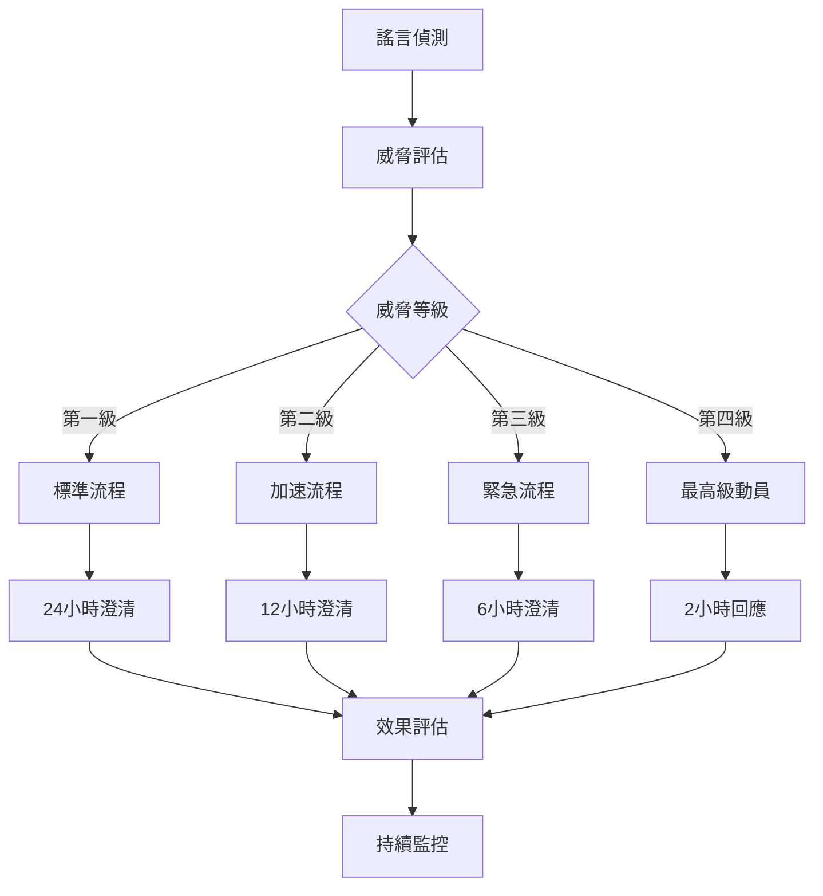

# 謠言傳播理論與反制策略

## 2026年中共非正規作戰情境應用

### 概述

謠言傳播理論是研究虛假或未經證實的資訊如何在社會中產生、演變和擴散的學科。在2026年中共可能發動的非正規作戰中，理解謠言傳播機制對於識別和反制資訊戰攻擊至關重要。本指南將深入探討謠言傳播的科學原理，並提供實用的識別與反制方法。

**核心目標**：建立科學化的謠言防護體系  
**適用情境**：資訊戰、心理戰、認知作戰防禦  
**目標群體**：政府機關、媒體工作者、一般民眾

---

## 一、謠言傳播理論基礎

### 1.1 謠言的定義與特性

#### 學術定義

**奧爾波特-波斯特曼公式（Allport-Postman Formula）**

```text
謠言強度 = 重要性 × 模糊性
R = I × A

R (Rumor) = 謠言強度
I (Importance) = 事件重要性
A (Ambiguity) = 資訊模糊性
```

**現代擴展公式**

```text
謠言傳播力 = (重要性 × 模糊性 × 情感強度) / 查證難度
RT = (I × A × E) / V

E (Emotion) = 情感強度
V (Verification) = 查證難度
```

#### 謠言的核心特徵

| 特徵 | 說明 | 在資訊戰中的表現 |
|------|------|-----------------|
| **未經證實** | 缺乏可靠的事實基礎 | 「內部消息」、「知情人士透露」 |
| **情感導向** | 激發強烈的情緒反應 | 恐懼、憤怒、絕望情緒 |
| **傳播性強** | 容易被人們轉發分享 | 病毒式在社群媒體擴散 |
| **變異性** | 在傳播過程中不斷變化 | 內容逐漸誇大扭曲 |
| **填補空白** | 滿足人們對未知的好奇 | 利用資訊真空期散布 |

### 1.2 謠言傳播的心理機制

#### 認知偏誤基礎

**確認偏誤（Confirmation Bias）**

- 人們傾向於相信符合既有信念的資訊
- 選擇性接受支持自己觀點的證據
- 忽略或質疑反駁自己觀點的資訊

**可得性捷思（Availability Heuristic）**

- 容易回想起的事件被認為更可能發生
- 媒體頻繁報導的事件被高估機率
- 生動具體的描述比抽象統計更有說服力

**錨定效應（Anchoring Effect）**

- 第一印象對後續判斷產生強烈影響
- 即使知道初始資訊有誤，仍難以擺脫
- 首次接觸的謠言內容成為判斷基準

#### 社會心理因素

**從眾心理（Social Proof）**

```text
當人們看到很多人相信某個訊息時，
會認為這個訊息更可信，
即使缺乏事實根據。
```

**權威崇拜（Authority Bias）**

```text
來自權威人士或機構的訊息
被認為更可信，
即使該權威在相關領域並非專家。
```

**群體極化（Group Polarization）**

```text
在群體討論中，
個人的觀點會變得更加極端，
謠言在群體中會被強化放大。
```

---

## 二、謠言傳播模型與階段

### 2.1 傳播模型理論

#### SIR模型（Susceptible-Infected-Recovered）

**基本概念**

```text
S (易感者) → I (感染者) → R (免疫者)

易感者：尚未接觸謠言的人群
感染者：相信並傳播謠言的人群
免疫者：不再相信或傳播謠言的人群
```

**數學表達**

```text
dS/dt = -βSI
dI/dt = βSI - γI  
dR/dt = γI

β = 傳播率
γ = 恢復率（澄清率）
```

#### SEIR模型（加入潛伏期）

```text
S (易感) → E (潛伏) → I (感染) → R (免疫)

E (Exposed) = 已接觸但尚未傳播謠言的人群
```

**在資訊戰中的應用**

- **易感期**：對特定議題關注但資訊不足
- **潛伏期**：接收到謠言但尚在判斷真偽
- **感染期**：相信謠言並積極傳播
- **免疫期**：識破謠言或接受澄清

### 2.2 謠言生命週期

#### 四階段演進模型

**第一階段：萌芽期（Emergence）**

```markdown
特徵：
- 資訊來源模糊
- 內容相對簡單
- 傳播範圍有限
- 真偽難以立即判斷

時間：0-6小時
傳播人數：10-100人
可信度：中等
```

**第二階段：發展期（Growth）**

```markdown
特徵：
- 內容開始變異
- 情感色彩加強
- 傳播速度加快
- 開始跨平台擴散

時間：6-24小時
傳播人數：100-10,000人
可信度：高峰期
```

**第三階段：高峰期（Peak）**

```markdown
特徵：
- 達到最大傳播範圍
- 主流媒體可能跟進
- 引發公眾討論
- 開始出現質疑聲音

時間：24-72小時
傳播人數：10,000-1,000,000人
可信度：開始下降
```

**第四階段：衰退期（Decline）**

```markdown
特徵：
- 官方澄清或查證
- 關注度逐漸下降
- 新的熱點話題出現
- 部分人群仍然相信

時間：72小時以後
傳播人數：逐漸減少
可信度：大幅降低
```

---

## 三、2026年情境下的謠言類型分析

### 3.1 戰略級謠言

#### 政治領導層攻擊

**典型謠言範例**

```text
「總統已秘密逃往美國」
「政府高層正在談判投降條件」
「國防部長私下接觸中共代表」
```

**傳播特徵分析**

- **重要性**：極高（攸關國家存亡）
- **模糊性**：高（難以即時查證）
- **情感強度**：極強（恐慌、絕望）
- **查證難度**：高（涉及機密）

**心理影響目標**

- 瓦解民眾對政府的信任
- 製造政治真空與領導危機
- 誘發投降主義情緒
- 破壞抵抗意志

#### 軍事實力貶損

**典型謠言範例**

```text
「台灣飛彈全被駭客癱瘓」
「美軍已撤出第一島鏈」
「國軍士兵大規模逃兵」
「F-16戰機無法起飛作戰」
```

**傳播模式**

```text
軍事機密 → 難以查證 → 專業包裝 → 權威背書 → 大眾傳播
```

### 3.2 戰術級謠言

#### 經濟恐慌製造

**謠言演化過程**

```markdown
初始版本：「台積電可能停產」
發展版本：「台積電已暗中停產」
高峰版本：「台積電全面遷移美國」
極端版本：「台灣科技業即將崩潰」
```

**情感操作技巧**

- **恐懼訴求**：「經濟即將崩潰」
- **急迫性**：「再不行動就來不及了」
- **從眾壓力**：「聰明人都已經...」
- **權威背書**：「專家預測」、「內部消息」

#### 社會分化煽動

**族群對立製造**

```markdown
目標：製造本省外省對立
手法：
1. 挑選爭議性歷史事件
2. 單方面解讀歷史
3. 激化情緒對立
4. 製造仇恨言論
5. 引發實體衝突
```

**世代衝突煽動**

```markdown
目標：製造世代價值觀衝突
手法：
1. 誇大世代差異
2. 簡化複雜問題
3. 貼標籤化處理
4. 激化對立情緒
5. 阻礙理性溝通
```

### 3.3 戰術級謠言案例深度分析

#### 案例：「美軍撤離台灣」謠言

**完整傳播鏈分析**

**T0時刻：謠言萌芽**

```markdown
初始內容：
「聽說美軍顧問團已經撤離台灣」

投放管道：
- 某軍事論壇匿名發文
- 內容相對簡潔模糊
- 聲稱消息來自「軍方內部」

心理設計：
- 利用民眾對美國支援的擔憂
- 模糊表述增加可信度
- 匿名發布降低查證可能
```

**T+6小時：內容變異**

```markdown
演化內容：
「美軍顧問團昨夜緊急撤離，
據說是接到華盛頓密令，
台海情勢比外界想像更嚴重」

新增元素：
- 時間具體化（昨夜）
- 權威背書（華盛頓密令）
- 情勢渲染（比想像嚴重）
- 因果關係暗示
```

**T+12小時：跨平台擴散**

```markdown
Facebook版本：
「美軍已撤，台灣孤立無援！
政府還在隱瞞真相！」

Line群組版本：
「轉發：美軍顧問緊急撤離台灣，
內幕消息請勿外傳」

PTT版本：
「爆卦：美軍顧問團已撤離台灣」
```

**T+24小時：媒體關注**

```markdown
網路媒體：
「美軍撤離傳言滿天飛，國防部尚未回應」

電視新聞：
「網路瘋傳美軍撤離消息，我們來求證...」

平面媒體：
「美軍撤離傳言 國防部：純屬謠言」
```

**T+48小時：官方澄清**

```markdown
國防部聲明：
「美軍顧問團駐台正常，
相關傳言純屬不實」

AIT聲明：
「美台軍事合作持續進行，
相關謠言毫無根據」
```

**傳播效果評估**

```markdown
傳播範圍：估計達到100萬人次
高峰期相信比例：約30%
澄清後仍相信比例：約10%
對美台關係信心影響：短期下降15%
```

---

## 四、謠言識別技術與方法

### 4.1 內容分析識別法

#### 語言特徵分析

**情感詞彙密度檢測**

```python
def analyze_emotional_density(text):
    """
    分析文本中情感詞彙的密度
    """
    emotional_words = ['驚人', '震撼', '恐怖', '末日', '崩潰', 
                      '背叛', '陰謀', '隱瞒', '爆料', '獨家']
    
    word_count = len(text.split())
    emotional_count = sum(1 for word in emotional_words if word in text)
    
    density = emotional_count / word_count
    
    if density > 0.1:
        return "高風險：情感詞彙密度過高"
    elif density > 0.05:
        return "中風險：情感詞彙密度偏高"
    else:
        return "正常：情感詞彙密度適中"
```

**權威性詞彙濫用檢測**

```python
def detect_false_authority(text):
    """
    檢測虛假權威背書
    """
    false_authority_patterns = [
        r'據.*專家.*透露',
        r'內部.*消息.*指出',
        r'權威.*人士.*表示',
        r'可靠.*消息.*來源',
        r'知情.*人士.*爆料'
    ]
    
    import re
    matches = []
    for pattern in false_authority_patterns:
        if re.search(pattern, text):
            matches.append(pattern)
    
    if len(matches) >= 2:
        return "高度可疑：多重虛假權威背書"
    elif len(matches) == 1:
        return "需要查證：可能的虛假權威"
    else:
        return "正常：無明顯虛假權威"
```

#### 邏輯結構分析

**因果關係檢驗**

```markdown
檢驗標準：
1. 原因是否充分？
2. 結果是否必然？
3. 中間環節是否完整？
4. 是否存在其他可能性？
5. 時間順序是否合理？

常見邏輯謬誤：
- 後此謬誤：時序上的先後不等於因果關係
- 假二分法：非黑即白的簡化思維
- 滑坡謬誤：誇大連鎖反應的可能性
- 稻草人謬誤：攻擊歪曲後的對方觀點
```

### 4.2 來源追蹤識別法

#### 溯源分析技術

**資訊族譜追蹤**

```text
原始發布 → 首次轉發 → 內容變異 → 跨平台傳播 → 媒體報導
    ↓           ↓           ↓           ↓           ↓
分析要點：   驗證身份    記錄變化    追蹤路徑    查證回應
- 發布時間   - 帳號屬性   - 內容對比   - 傳播速度   - 官方聲明
- 發布位置   - 歷史記錄   - 新增元素   - 影響範圍   - 專家意見
- 發布動機   - 可信度     - 刪除內容   - 用戶反應   - 事實查核
```

**數位足跡分析**

```python
def analyze_digital_footprint(account_info):
    """
    分析發布者的數位足跡
    """
    risk_score = 0
    
    # 帳號年齡檢查
    if account_info['age_days'] < 30:
        risk_score += 30
    elif account_info['age_days'] < 90:
        risk_score += 10
    
    # 發文頻率檢查
    if account_info['posts_per_day'] > 50:
        risk_score += 25
    elif account_info['posts_per_day'] > 20:
        risk_score += 10
    
    # 互動比例檢查
    interaction_ratio = account_info['interactions'] / account_info['followers']
    if interaction_ratio < 0.01:
        risk_score += 20
    
    # 內容一致性檢查
    if account_info['political_consistency'] < 0.3:
        risk_score += 15
    
    return risk_score
```

### 4.3 時機分析識別法

#### 投放時機模式分析

**敏感時機檢測**

```markdown
高風險時機：
1. 重大政治事件前後
2. 軍事演習期間
3. 國際會議召開時
4. 選舉關鍵時期
5. 自然災害發生時
6. 經濟數據發布前

時機分析要點：
- 謠言是否與時事高度關聯？
- 投放時機是否過於「巧合」？
- 是否在資訊真空期投放？
- 是否配合其他事件炒作？
```

**傳播速度異常檢測**

```python
def detect_abnormal_spread(spread_data):
    """
    檢測異常的傳播速度
    """
    normal_growth_rate = 0.1  # 正常謠言每小時成長10%
    
    for hour, shares in enumerate(spread_data):
        expected_shares = shares[0] * (1 + normal_growth_rate) ** hour
        actual_shares = shares
        
        if actual_shares > expected_shares * 5:
            return f"第{hour}小時傳播異常：疑似人工操作"
    
    return "傳播速度正常"
```

---

## 五、謠言反制策略與技術

### 5.1 預防性策略

#### 資訊免疫系統建構

**群體免疫理論應用**

```text
免疫閾值 = 1 - (1/R0)

R0 = 基本再生數（一個相信謠言的人平均會傳播給幾個人）

當群體中有足夠比例的人具備謠言識別能力時，
謠言就無法大規模傳播
```

**預先澄清策略（Prebunking）**

```markdown
實施步驟：
1. 識別可能的謠言主題
2. 預先準備事實資料
3. 教育民眾識別技巧
4. 建立快速回應機制
5. 強化可信資訊來源

優勢：
- 先發制人，搶占認知高地
- 提前建立心理防線
- 降低謠言傳播效率
- 增強社會免疫力
```

#### 可信資訊生態建構

**權威資訊源強化**

```markdown
政府層面：
- 提高資訊透明度
- 建立定期發布機制
- 加強與媒體溝通
- 提升回應速度

媒體層面：
- 強化事實查核能力
- 建立同業監督機制
- 提高專業素養
- 增強公信力

民間層面：
- 培養媒體素養
- 建立查核網絡
- 促進理性討論
- 強化社群自律
```

### 5.2 即時應對策略

#### 快速偵測系統

**自動監測機制**

```python
class RumorDetectionSystem:
    def __init__(self):
        self.keywords = ['驚爆', '獨家', '內幕', '政府隱瞞']
        self.sources = ['social_media', 'forums', 'messaging_apps']
        self.threshold = 0.7
    
    def monitor_content(self):
        """
        持續監測網路內容
        """
        for source in self.sources:
            content = self.fetch_content(source)
            risk_score = self.calculate_risk(content)
            
            if risk_score > self.threshold:
                self.alert_human_verifiers(content, risk_score)
    
    def calculate_risk(self, content):
        """
        計算內容風險分數
        """
        keyword_score = self.check_keywords(content)
        emotional_score = self.analyze_emotion(content)
        source_score = self.verify_source(content)
        timing_score = self.check_timing(content)
        
        return (keyword_score + emotional_score + 
                source_score + timing_score) / 4
```

**人工智慧輔助判斷**

```python
def ai_assisted_verification(rumor_text):
    """
    AI輔助的謠言驗證
    """
    # 語義分析
    semantic_features = extract_semantic_features(rumor_text)
    
    # 情感分析
    emotional_features = analyze_emotional_content(rumor_text)
    
    # 事實檢索
    fact_check_results = search_fact_database(rumor_text)
    
    # 來源分析
    source_credibility = analyze_source_credibility(rumor_text)
    
    # 綜合判斷
    final_score = ml_model.predict([
        semantic_features,
        emotional_features,
        fact_check_results,
        source_credibility
    ])
    
    return {
        'rumor_probability': final_score,
        'confidence': calculate_confidence(final_score),
        'key_factors': identify_key_factors(rumor_text)
    }
```

#### 精準澄清技術

**目標受眾分析**

```markdown
受眾分群策略：
1. 已相信者：提供具體反證
2. 懷疑者：加強可信資訊
3. 未接觸者：預防性教育
4. 意見領袖：優先溝通

溝通管道選擇：
- 官方管道：政府聲明、記者會
- 媒體管道：新聞報導、專題節目
- 社群管道：社交媒體、論壇
- 人際管道：意見領袖、同儕網絡
```

**澄清內容優化**

```markdown
有效澄清原則：
1. 事實為先：提供具體證據
2. 邏輯清晰：避免複雜論述
3. 情感平衡：不激化對立
4. 權威背書：可信專家支持
5. 視覺化呈現：圖表、影片
6. 重複強化：多次澄清

避免事項：
- 不要重複謠言內容
- 不要使用過於技術性語言
- 不要忽視情感因素
- 不要單一管道澄清
```

### 5.3 長期建構策略

#### 媒體素養全民教育

**分層教育體系**

```markdown
國民教育階段：
- 基礎批判思考訓練
- 資訊來源識別教育
- 科學方法啟蒙
- 民主價值培養

高等教育階段：
- 進階媒體素養課程
- 資訊戰識別訓練
- 事實查核技能
- 公民參與責任

成人教育階段：
- 社區媒體素養推廣
- 職場資訊安全教育
- 家庭數位教養
- 銀髮族防詐宣導
```

**實務操作訓練**

```markdown
基礎技能訓練：
□ 資訊來源查證方法
□ 搜尋引擎有效使用
□ 事實查核網站應用
□ 社群媒體安全設定

進階技能訓練：
□ 數位足跡分析
□ 論述邏輯檢驗
□ 統計數據解讀
□ 國際資訊比對
```

#### 社會韌性建構

**社群防護網絡**

```markdown
組織架構：
- 社區媒體素養小組
- 志願事實查核員
- 專業諮詢顧問團
- 跨域合作平台

運作機制：
- 定期教育訓練
- 即時資訊分享
- 協作查證機制
- 成效評估改進
```

**制度化保障**

```markdown
法律層面：
- 假訊息防制法規
- 媒體責任規範
- 平台治理要求
- 公民保護措施

政策層面：
- 國家資訊安全戰略
- 媒體素養推廣政策
- 數位國民權利保障
- 國際合作框架
```

---

## 六、實戰案例深度解析

### 6.1 案例研究：「政府秘密談判」謠言

#### 背景設定

```markdown
時間：2026年10月某日
情境：台海緊張情勢升高期間
謠言內容：「政府正與中方秘密談判投降條件」
投放管道：多個社群媒體平台同時出現
```

#### 傳播模式分析

**第一波：種子投放（0-2小時）**

```markdown
投放策略：
- 5個不同平台同時發布
- 使用不同但相似的帳號
- 內容略有差異但核心一致
- 時間間隔15-30分鐘

心理設計：
- 利用民眾對政府的不信任
- 配合緊張國際情勢
- 製造多方消息印象
- 增加可信度感知
```

**第二波：內容變異（2-8小時）**

```markdown
演化方向：
1. 具體化：加入「談判地點」、「參與人員」
2. 權威化：聲稱「外交官證實」、「軍方內部」
3. 急迫化：「48小時內簽署協議」
4. 情緒化：「背叛人民」、「賣國行為」

傳播特點：
- 轉發時主動加入個人評論
- 不同社群產生不同變異版本
- 開始出現「求證」訊息
- 情感強度逐漸升高
```

**第三波：跨域擴散（8-24小時）**

```markdown
擴散路徑：
Facebook → Line群組 → PTT → Dcard → YouTube → 傳統媒體

關鍵節點：
- 知名YouTuber討論此事
- 政治人物間接回應
- 媒體記者嘗試求證
- 國際媒體開始關注
```

#### 反制措施實施

**即時偵測（T+1小時）**

```markdown
系統警報：
- AI監測系統發現多平台同時出現相似內容
- 風險評分：8.5/10（高風險）
- 自動標記為優先查證項目
- 通知相關部門準備回應
```

**快速查證（T+2小時）**

```markdown
查證流程：
1. 總統府幕僚確認：無任何秘密談判
2. 外交部確認：無相關外交接觸
3. 國安會確認：無此政策討論
4. 國防部確認：無軍方人員參與

查證結果：完全不實
```

**多管道澄清（T+3小時）**

```markdown
澄清策略：
1. 總統府：發布正式聲明駁斥謠言
2. 外交部：說明實際兩岸互動狀況
3. 國防部：重申國防立場不變
4. 事實查核中心：發布查核報告

澄清內容要點：
- 明確否認謠言內容
- 提供真實政策立場
- 解釋謠言可能來源
- 呼籲民眾理性判斷
```

**效果追蹤與評估**

```markdown
24小時後統計：
- 謠言傳播人數：約50萬人
- 澄清訊息觸及：約200萬人
- 相信謠言比例：從30%降至8%
- 媒體跟進澄清：15家主要媒體
- 後續影響：短期內政府信任度下降5%
```

### 6.2 案例研究：「經濟數據造假」謠言

#### 謠言內容演進

```markdown
初始版本：「政府美化失業率數據」
發展版本：「主計總處被要求修改統計方法」
高峰版本：「實際失業率是官方數字的三倍」
極端版本：「台灣經濟已陷入大蕭條」
```

#### 傳播心理分析

```markdown
認知利用：
- 民眾對統計數字的不理解
- 對政府的本能不信任
- 經濟焦慮的普遍存在
- 對專業術語的畏懼

情感操作：
- 不安：「真實情況被隱瞞」
- 憤怒：「政府欺騙人民」
- 絕望：「經濟無可救藥」
- 恐慌：「生活將陷入困境」
```

#### 反制策略執行

```markdown
專業澄清：
1. 主計總處：詳細說明統計方法
2. 經濟學者：解讀數據真實含義
3. 國際比較：提供國際對比數據
4. 歷史脈絡：說明長期發展趨勢

民眾教育：
- 統計知識普及
- 數據解讀訓練
- 經濟指標介紹
- 批判思考訓練
```

---

## 七、國際經驗與案例借鑑

### 7.1 俄烏戰爭資訊戰經驗

#### 俄羅斯謠言戰術分析

```markdown
主要手法：
1. 多重矛盾敘事並行投放
2. 混合真實信息與虛假內容
3. 利用西方媒體自由度漏洞
4. 培養當地代理人傳播
5. 長期文化認同滲透

成功因素：
- 長期佈局與準備
- 專業化操作團隊
- 多語言多平台協作
- 結合外交軍事行動
```

#### 烏克蘭反制措施

```markdown
防禦策略：
1. 建立國家級事實查核機制
2. 與國際平台合作標記假訊息
3. 加強媒體素養教育
4. 動員民間志願查核力量
5. 善用國際同情與支持

成效評估：
- 有效維持國內團結
- 爭取國際輿論支持
- 降低敵方宣傳效果
- 增強社會韌性
```

### 7.2 新加坡POFMA法案經驗

#### 法制化反制機制

```text
POFMA (Protection from Online Falsehoods and Manipulation Act)

核心機制：
1. 政府有權要求澄清或移除假訊息
2. 平台必須配合執行政府指令
3. 違法者面臨刑事及民事責任
4. 建立快速司法救濟程序

爭議討論：
- 政府權力邊界問題
- 言論自由保障疑慮
- 執行標準一致性
- 國際社會反應
```

#### 執行效果分析

```markdown
正面效果：
- 假訊息傳播速度明顯減緩
- 提高發布虛假資訊成本
- 增強政府公信力
- 維護社會穩定

負面效應：
- 可能過度限制言論自由
- 增加自我審查傾向
- 國際形象受到質疑
- 執行標準爭議不斷
```

### 7.3 芬蘭媒體素養教育模式

#### 全民教育體系

```markdown
教育理念：
- 從小培養批判思考能力
- 將媒體素養融入各科教學
- 強調實務操作與體驗學習
- 重視國際視野與比較分析

實施方法：
1. 國小階段：基礎識別訓練
2. 國中階段：邏輯思辨培養
3. 高中階段：深度分析能力
4. 大學階段：專業技能發展
5. 成人教育：持續學習機制
```

#### 成效與啟示

```markdown
成果指標：
- 芬蘭在歐盟媒體素養排名第一
- 假訊息影響程度最低
- 民眾對媒體信任度高
- 社會整體韌性強

借鑑要點：
- 長期系統性投入
- 跨領域整合教學
- 理論與實務並重
- 持續更新內容方法
```

---

## 八、技術工具與平台應用

### 8.1 自動化監測工具

#### 開源監測系統

```python
class OpenSourceRumorMonitor:
    def __init__(self):
        self.platforms = ['facebook', 'twitter', 'ptt', 'dcard']
        self.keywords = self.load_keywords()
        self.ml_model = self.load_trained_model()
    
    def continuous_monitoring(self):
        """
        持續監測多個平台
        """
        while True:
            for platform in self.platforms:
                posts = self.fetch_posts(platform)
                for post in posts:
                    risk_score = self.analyze_post(post)
                    if risk_score > 0.8:
                        self.send_alert(post, risk_score)
            
            time.sleep(300)  # 每5分鐘檢查一次
    
    def analyze_post(self, post):
        """
        分析單篇貼文的風險分數
        """
        features = self.extract_features(post)
        return self.ml_model.predict_proba(features)[0][1]
```

#### 商業監測平台

```markdown
推薦平台：
1. Hootsuite Insights
   - 社群媒體監測
   - 情感分析
   - 趨勢追蹤
   - 競爭對手分析

2. Brandwatch
   - 全網監測
   - AI 驅動分析
   - 自定義警報
   - 報告生成

3. Mention
   - 即時監測
   - 多語言支持
   - 影響力分析
   - API 整合
```

### 8.2 事實查核工具

#### 反向圖片搜尋

```python
def reverse_image_search(image_url):
    """
    使用多個搜尋引擎進行反向圖片搜尋
    """
    search_engines = [
        'https://www.google.com/searchbyimage?image_url=',
        'https://www.tineye.com/search/?url=',
        'https://yandex.com/images/search?url='
    ]
    
    results = []
    for engine in search_engines:
        search_url = engine + image_url
        result = requests.get(search_url)
        parsed_result = parse_search_result(result)
        results.append(parsed_result)
    
    return analyze_image_authenticity(results)
```

#### 語音分析工具

```python
def analyze_audio_authenticity(audio_file):
    """
    分析音訊的真實性
    """
    # 波形分析
    waveform_analysis = analyze_waveform_patterns(audio_file)
    
    # 頻譜分析
    spectrum_analysis = analyze_frequency_spectrum(audio_file)
    
    # 人工合成檢測
    synthetic_detection = detect_synthetic_speech(audio_file)
    
    authenticity_score = calculate_authenticity_score(
        waveform_analysis, spectrum_analysis, synthetic_detection
    )
    
    return {
        'authentic_probability': authenticity_score,
        'key_indicators': identify_manipulation_signs(audio_file),
        'confidence_level': calculate_confidence(authenticity_score)
    }
```

### 8.3 協作查核平台

#### 群眾外包查核系統

```python
class CrowdsourcedFactCheck:
    def __init__(self):
        self.verifiers = self.load_verified_users()
        self.reputation_system = ReputationSystem()
    
    def submit_for_verification(self, claim):
        """
        提交待查證內容
        """
        # 選擇合適的查證員
        selected_verifiers = self.select_verifiers(claim)
        
        # 分派查證任務
        tasks = self.create_verification_tasks(claim, selected_verifiers)
        
        # 收集查證結果
        results = self.collect_verification_results(tasks)
        
        # 達成共識
        consensus = self.reach_consensus(results)
        
        return consensus
    
    def select_verifiers(self, claim):
        """
        根據專業領域選擇查證員
        """
        claim_category = self.categorize_claim(claim)
        qualified_verifiers = [
            v for v in self.verifiers 
            if claim_category in v.expertise
        ]
        
        # 按聲譽排序並選擇前幾名
        qualified_verifiers.sort(key=lambda x: x.reputation, reverse=True)
        return qualified_verifiers[:5]
```

---

## 九、應急響應機制

### 9.1 分級響應體系

#### 威脅等級分類

```markdown
第一級：一般謠言（綠色）
特徵：
- 影響範圍有限
- 危害程度較低
- 傳播速度緩慢
- 查證相對容易

響應措施：
- 標準查證流程
- 24小時內澄清
- 常規媒體發布
- 社群平台標記

第二級：有害謠言（黃色）
特徵：
- 影響範圍較廣
- 可能造成社會不安
- 傳播速度較快
- 需要專業查證

響應措施：
- 加速查證流程
- 12小時內澄清
- 多管道同步發布
- 重點人群溝通

第三級：危險謠言（橙色）
特徵：
- 影響範圍很廣
- 嚴重威脅社會穩定
- 傳播速度極快
- 查證具有挑戰性

響應措施：
- 緊急查證機制
- 6小時內澄清
- 全媒體緊急發布
- 政府高層回應

第四級：災難謠言（紅色）
特徵：
- 全國性影響
- 威脅國家安全
- 病毒式傳播
- 複雜度極高

響應措施：
- 最高級別動員
- 2小時內回應
- 總統府層級澄清
- 國際媒體同步
```

### 9.2 快速響應流程

#### 緊急動員機制



#### 跨部門協調機制

```markdown
指揮中心：行政院發言人室
- 統籌協調各部會回應
- 決定澄清策略與內容
- 監控輿情發展變化
- 評估政策影響

核心成員：
- 總統府發言人
- 行政院發言人
- 相關部會首長
- 國安會代表
- 專業諮詢顧問

支援單位：
- 各部會發言人
- 事實查核組織
- 媒體關係專員
- 數位傳播團隊
```

### 9.3 危機溝通策略

#### 溝通原則與技巧

```markdown
PEACE原則：
P (Partnership) - 夥伴關係：與媒體建立合作關係
E (Empathy) - 同理心：理解民眾擔憂與焦慮
A (Acknowledgment) - 承認：承認問題的嚴重性
C (Clarity) - 清晰：提供明確具體的資訊
E (Engagement) - 參與：持續與公眾互動交流

溝通技巧：
1. 先說結論：直接回答核心問題
2. 提供證據：用具體事實支撐論點
3. 承認限制：誠實面對不確定性
4. 表達關懷：理解民眾感受
5. 持續更新：隨時提供最新資訊
```

#### 多管道傳播策略

```markdown
官方管道：
- 政府新聞稿
- 官方網站更新
- 記者會說明
- 立法院報告

媒體管道：
- 主流媒體投書
- 電視專訪
- 廣播節目
- 網路媒體

社群管道：
- Facebook 官方粉絲頁
- Twitter 即時訊息
- LINE 官方帳號
- YouTube 影片說明

直接溝通：
- 公聽會說明
- 社區座談會
- 網路直播
- 民眾信箱回覆
```

---

## 十、效果評估與持續改進

### 10.1 評估指標體系

#### 量化指標

```markdown
傳播指標：
- 謠言觸及人數
- 傳播速度
- 跨平台擴散率
- 高峰期持續時間

影響指標：
- 相信比例變化
- 行為改變程度
- 情緒波動幅度
- 信任度影響

應對指標：
- 偵測速度
- 澄清時效
- 澄清觸及率
- 澄清有效性

社會指標：
- 媒體關注度
- 政治討論熱度
- 社會穩定程度
- 國際形象影響
```

#### 質化評估

```markdown
內容分析：
- 謠言變異模式
- 論述框架演變
- 情感操作技巧
- 目標群體特徵

反應分析：
- 不同群體反應差異
- 澄清接受程度
- 後續行為變化
- 長期態度影響

策略效果：
- 澄清策略適當性
- 溝通管道有效性
- 時機把握準確性
- 資源配置合理性
```

### 10.2 機器學習優化

#### 預測模型改進

```python
class RumorPredictionModel:
    def __init__(self):
        self.features = [
            'content_emotional_intensity',
            'source_credibility_score', 
            'timing_sensitivity',
            'topic_relevance',
            'social_context_factor'
        ]
        self.model = None
    
    def train_model(self, historical_data):
        """
        基於歷史數據訓練預測模型
        """
        X = historical_data[self.features]
        y = historical_data['spread_intensity']
        
        from sklearn.ensemble import RandomForestRegressor
        self.model = RandomForestRegressor(n_estimators=100)
        self.model.fit(X, y)
    
    def predict_spread_potential(self, new_rumor):
        """
        預測新謠言的傳播潛力
        """
        features = self.extract_features(new_rumor)
        spread_prediction = self.model.predict([features])[0]
        
        return {
            'spread_intensity': spread_prediction,
            'risk_level': self.categorize_risk(spread_prediction),
            'recommended_response': self.suggest_response(spread_prediction)
        }
```

#### 動態調整機制

```python
def adaptive_response_system(rumor_data, response_history):
    """
    基於歷史效果動態調整應對策略
    """
    # 分析歷史應對效果
    effectiveness_analysis = analyze_historical_effectiveness(response_history)
    
    # 識別最佳實踐
    best_practices = identify_best_practices(effectiveness_analysis)
    
    # 根據謠言特徵匹配策略
    similar_cases = find_similar_historical_cases(rumor_data, response_history)
    
    # 生成優化建議
    optimized_strategy = generate_optimized_strategy(
        rumor_data, best_practices, similar_cases
    )
    
    return optimized_strategy
```

### 10.3 系統化改進流程

#### 定期檢討機制

```markdown
每週檢討：
- 新發現謠言類型分析
- 應對措施效果評估
- 系統性能優化調整
- 團隊能力培訓需求

每月總結：
- 謠言趨勢變化分析
- 反制策略效果統計
- 國際經驗學習整合
- 技術工具升級評估

季度評估：
- 整體防護能力評估
- 戰略調整建議提出
- 資源配置優化方案
- 長期發展規劃修訂

年度檢視：
- 全年成效綜合評估
- 國際比較標竿學習
- 新興威脅趨勢預測
- 下年度戰略制定
```

#### 持續學習機制

```markdown
案例資料庫建設：
- 詳細記錄每個謠言案例
- 分析傳播模式與反制效果
- 建立可搜尋的知識庫
- 支援快速決策參考

最佳實踐分享：
- 定期舉辦經驗交流會
- 建立跨部門學習平台
- 與國際組織合作交流
- 推動學術研究合作

創新實驗計畫：
- 新技術試點應用
- 創新策略測試驗證
- 跨域合作探索
- 前瞻性研究投入
```

---

## 結論與未來展望

### 核心發現與啟示

**謠言傳播的科學性**
謠言並非隨機現象，而是遵循可預測的科學規律。透過奧爾波特-波斯特曼公式我們了解到，謠言強度與事件重要性和資訊模糊性成正比。這個發現為我們提供了兩個重要的反制方向：降低事件的主觀重要性，以及減少資訊的模糊性。

**心理機制的重要性**
人類的認知偏誤是謠言得以傳播的心理基礎。確認偏誤、可得性捷思、從眾心理等心理機制，使得人們在面對謠言時往往失去理性判斷。理解這些心理機制，有助於設計更有效的反制策略。

**技術手段的雙刃劍性質**
現代資訊技術既是謠言快速傳播的推手，也是我們反制謠言的重要工具。AI技術可以幫助我們快速識別和分析謠言，但同時也可能被用來製造更加逼真的假資訊。技術競賽將是未來資訊戰的重要戰場。

### 2026年情境下的挑戰

**複合式攻擊**
在2026年的假想情境中，中共可能採用複合式的資訊攻擊，結合軍事威脅、經濟施壓、政治滲透等多重手段，使得謠言的背景更加複雜，反制難度大幅增加。

**即時性要求**
現代社會的資訊傳播速度極快，謠言可能在數小時內達到全國性影響。這要求我們建立更加敏捷的偵測和回應機制，在黃金時間內進行有效反制。

**國際化挑戰**
資訊戰具有跨國性特徵，需要國際合作才能有效應對。然而，不同國家的法律制度、文化背景、價值觀念存在差異，增加了合作的複雜性。

### 反制策略的演進方向

**預防重於治療**
未來的謠言反制將更加重視預防性措施，通過提升全民媒體素養、建構可信資訊生態、強化社會韌性等方式，從根本上降低謠言的傳播效力。

**技術與人文並重**
單純依賴技術手段無法完全解決謠言問題，必須結合人文關懷、心理支持、社會連結等軟性力量，建構全方位的防護體系。

**國際合作深化**
面對跨國性的資訊威脅，各民主國家需要加強合作，分享經驗、技術和資源，共同建構國際性的資訊安全防護網絡。

### 實踐建議

**政府層面**

- 建立國家級謠言監測與反制中心
- 制定完善的法律法規框架
- 加強國際合作與經驗交流
- 投資相關技術研發與人才培養

**媒體層面**

- 強化專業倫理與自律機制
- 提升事實查核能力
- 加強與公眾的溝通互動
- 善用新技術提升工作效率

**民間層面**

- 積極參與媒體素養教育
- 建立社區防護網絡
- 培養批判思考能力
- 承擔公民責任與義務

**個人層面**

- 提升資訊識別能力
- 養成查證習慣
- 理性參與公共討論
- 傳播正確資訊

### 未來展望

隨著技術的進步和經驗的累積，我們對謠言傳播機制的理解將更加深入，反制手段也將更加精準有效。然而，這是一場長期的競賽，需要全社會的持續投入和努力。

最終，戰勝謠言的關鍵不在於技術的先進程度，而在於民主社會的韌性和民眾的理性。只有當每個公民都具備足夠的媒體素養和批判思考能力時，謠言才會失去滋生的土壤。

在面對2026年可能的挑戰時，我們有信心運用科學的方法、先進的技術、以及最重要的——團結的力量，共同守護真相，維護民主社會的資訊環境。

---

**版本資訊**

- 版本：v1.0
- 最後更新：2024年
- 適用情境：2026年中共非正規作戰防護
- 更新週期：每季度檢視修正

**參考資料**

- Allport, G. W., & Postman, L. (1947). The Psychology of Rumor
- DiFonzo, N., & Bordia, P. (2007). Rumor Psychology: Social and Organizational Approaches
- Sunstein, C. R. (2009). On Rumors: How Falsehoods Spread
- 當代相關研究文獻與國際案例分析

**免責聲明**
本指南所有情境設定均為理論探討，請讀者理性應用相關概念與方法。
